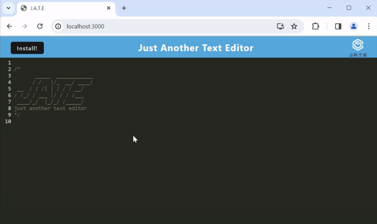

# Progressive Web Applications: PWA Text Editor 

By `Shane Mindreau`

[`Click Here For Deployed Site`](https://amazing-pwa-text-editor-4c7c56f5352b.herokuapp.com/)

## Description

A browser text editor capable of offline function, utilizing an IndexedDB database.

## Table of Contents

- [Installation](#installation)
- [Usage](#usage)
- [Credits](#credits)
- [License](#license)
- [Badges](#badges)
- [Tests](#tests)

## Installation

1. Installation is simple. All you need to do is clone the GitHub repository (and install Node if you do not already have it).

2. From there, do an `npm install` in the terminal of the correct directory to get the necessary packages if you are running the app locally.

3. Next, in the same terminal run `npm run install` to install node packages to the client and server directories.

4. Afterwards, you will need to bundle your assests. For this run the `npm run build` command, again in the terminal of your root directory.

5. Lastly, to run it locally run the `npm run start:dev` command to run the app locally. It will be running on the port 3000, so simply place `http://localhost:3000/` into the browser of your choice to see the app running.

## Usage

The following animation demonstrates the application functionality:

The following image shows the application's `manifest.json` file:

The following image shows the application's registered service worker:

The following image shows the application's IndexedDB storage:

## Credits

For this project we utilized Node.js, using the npm packages:

- idb: 6.1.2 (a lightweight wrapper for the IndexedDB API.)
- concurrently: 5.2.0
- express: 4.17.1
- As well as a few other plugins 

The starter code was provided by Colombia University's Full Stack Flex Web Development Bootcamp.

## License

MIT License

## Badges

N/A

## Tests

There currently are no tests set up for this app's code.
